<div align="center">

# SpendKaro Dashboard

**A clean, fast, role-aware personal finance dashboard**  
Track spending · Visualise patterns · Stay in control

[](https://spendkaro-dashboard.vercel.app)
[](https://react.dev)
[](https://www.typescriptlang.org)
[](https://tailwindcss.com)
[](https://vitejs.dev)

</div>

---

## Overview

SpendKaro is a frontend-only finance dashboard built as a professional assignment submission. It simulates a real personal finance product — with transaction management, rich visualisations, role-based access control, and smart spending insights — all powered by static mock data and localStorage persistence.

The project follows a **feature-based architecture** with strict TypeScript, barrel exports, lazy-loaded routes, and a carefully crafted dark/light design system.

---

## Live Demo

**[spendkaro-dashboard.vercel.app](https://spendkaro-dashboard.vercel.app)**

No login required. Switch between **Viewer** and **Admin** roles in the top bar to see the full feature set.

---

## Screenshots

### Desktop · Admin · Dark

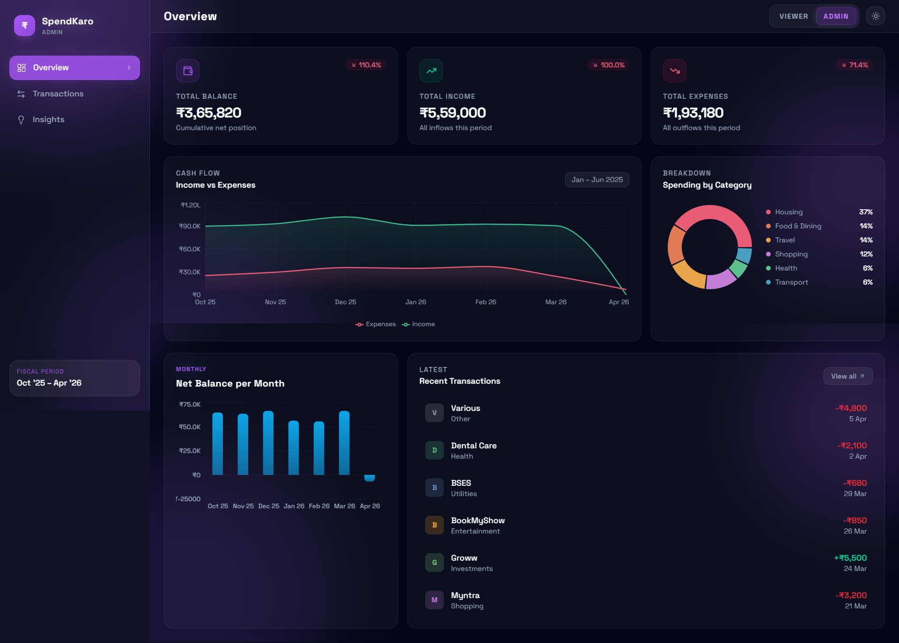
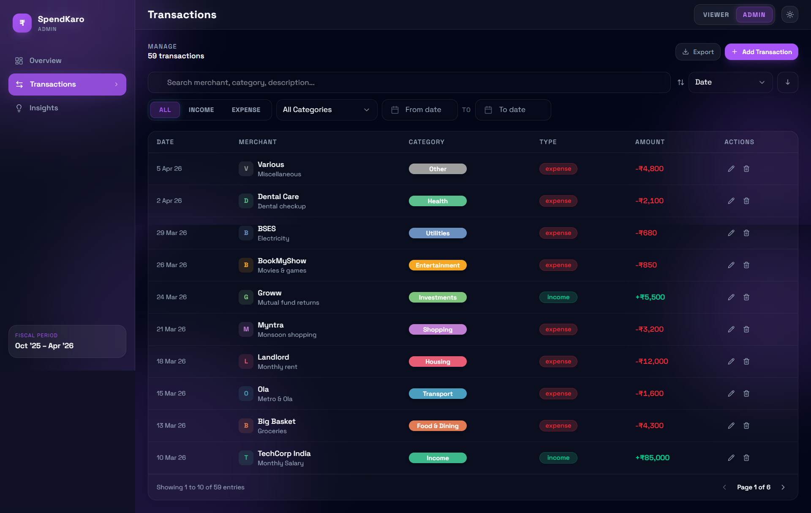
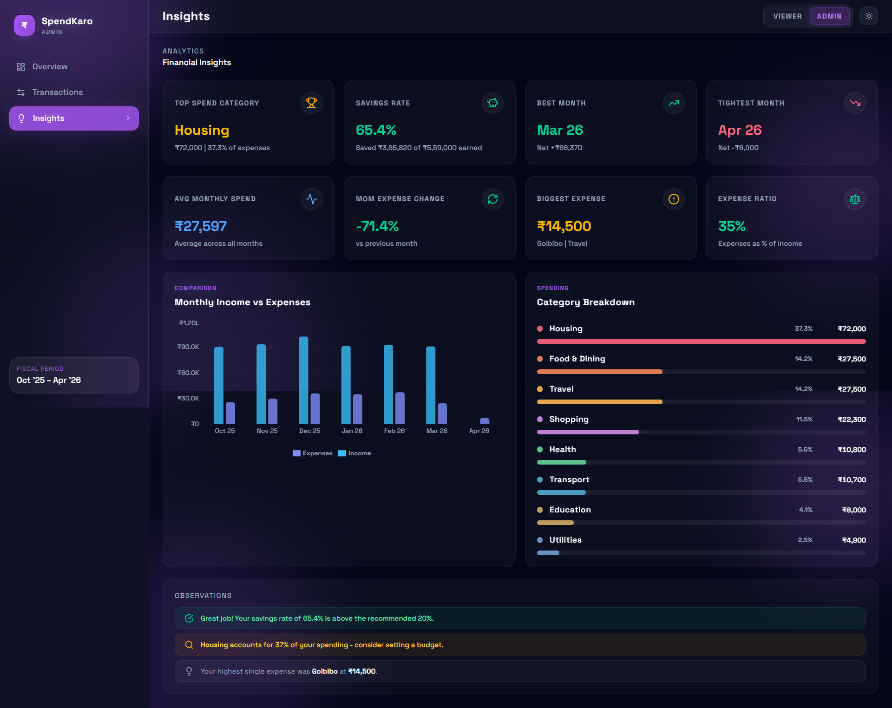

### Desktop · Admin · Light

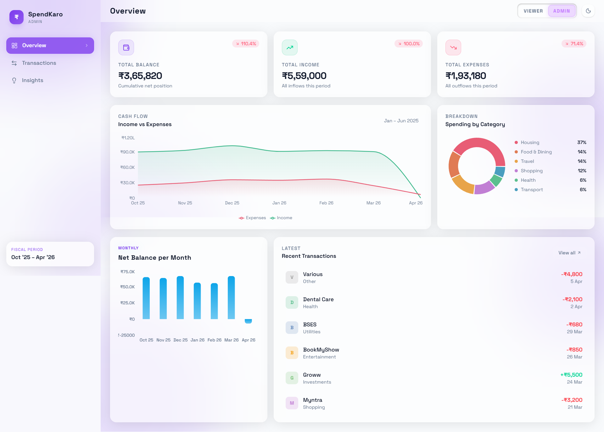
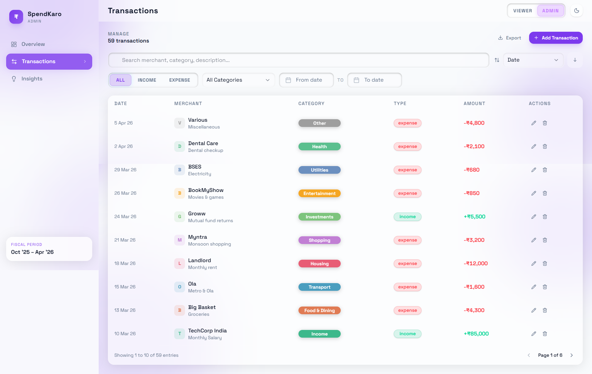
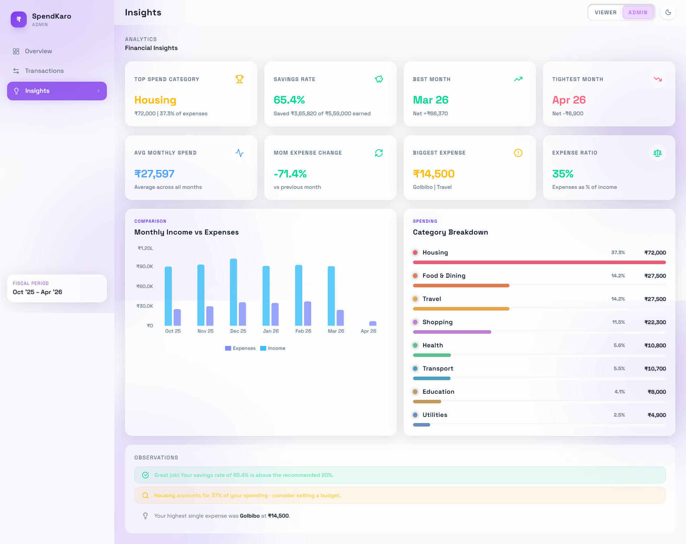

### Mobile · Admin · Dark

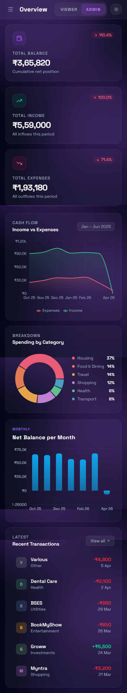
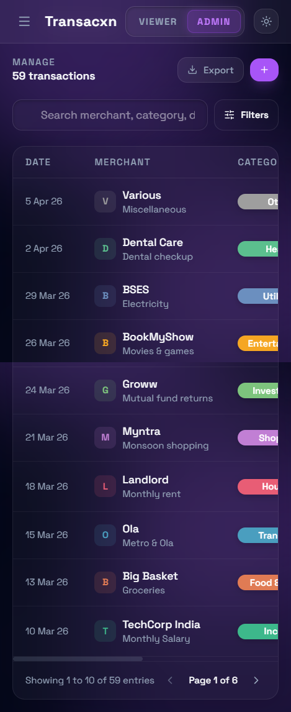
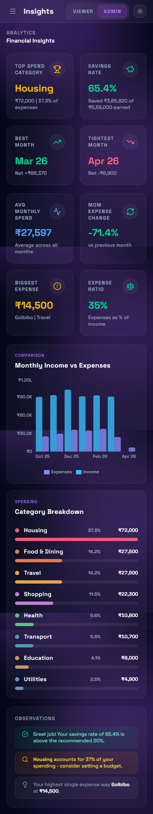

### Mobile · Admin · Light

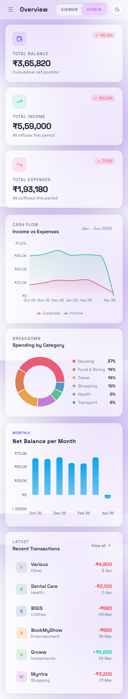
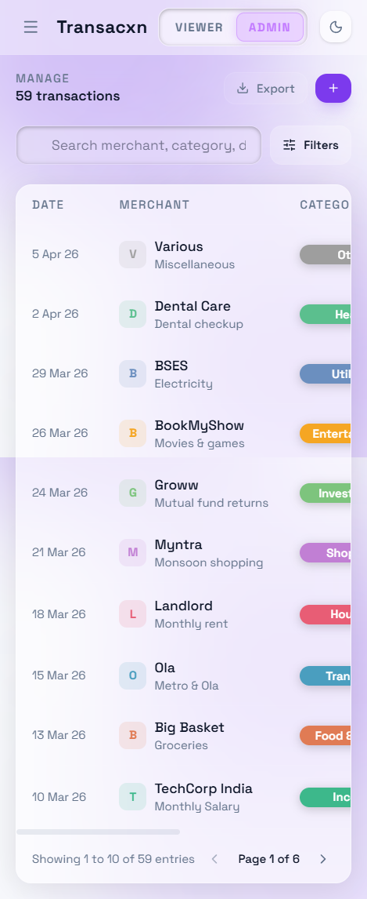
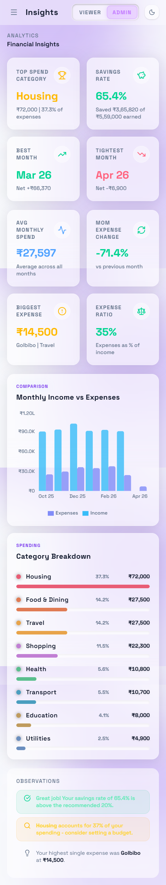

---

## Features

### Dashboard Overview
- Summary cards for **Total Balance**, **Total Income**, and **Total Expenses** with month-over-month percentage change
- **Cash flow area chart** — income vs expenses trend over the 6-month period
- **Spending donut chart** — top categories by proportion of total spend
- **Net balance bar chart** — monthly net position, colour-coded positive/negative
- **Recent transactions** strip with quick "View all" navigation

### Transactions
- Full transaction list with **date, merchant, category, type, and amount**
- **Full-text search** across merchant, category, and description
- **Type filter** — All / Income / Expense toggle
- **Category filter** — all 12 spending categories
- **Date range picker** — powered by `react-day-picker`
- **Multi-field sort** — by date, amount, category, or merchant (ascending/descending)
- **Export to CSV and JSON** — filtered results only
- **Admin CRUD** — add new transactions, inline edit, delete (Admin role only)

### Role-Based UI
| Role | Capabilities |
|------|-------------|
| **Viewer** | Read-only — sees all data, charts, and insights |
| **Admin** | Full access — add, edit, and delete transactions |

Switch roles instantly via the inline toggle in the top bar. No auth, no backend — pure frontend simulation.

### Insights & Analytics
- **Top spending category** with amount and % of total spend
- **Savings rate** — percentage of income retained, with contextual colour coding
- **Best and tightest months** — highest and lowest net balance
- **Month-over-month expense change** — vs the previous month
- **Biggest single expense** — merchant and category
- **Expense ratio** — expenses as a % of income
- **Average monthly spend** — across all recorded months
- **Monthly comparison bar chart** — income vs expenses side-by-side
- **Category horizontal bar chart** — proportional bars per category
- **Dynamic observations panel** — context-aware recommendations based on the actual data (e.g. savings rate alerts, top-category warnings, MoM spike notices)

### Bonus Features
- 🌙 **Dark / Light mode** — toggle persisted to localStorage
- 💾 **Full localStorage persistence** — transactions, role, and theme survive page refreshes
- ⚡ **Code splitting** — all three pages lazy-loaded via `React.lazy` + `Suspense`
- 📤 **Data export** — download current filtered view as CSV or JSON
- 📱 **Fully responsive** — mobile sidebar overlay, fluid grid layouts
- ✨ **Smooth animations** — page entry, modal entrance, bar chart reveals

---

## Tech Stack

| Library | Version | Purpose |
|---------|---------|---------|
| [React](https://react.dev) | 19 | UI framework |
| [TypeScript](https://www.typescriptlang.org) | 5.9 | Static typing |
| [Vite](https://vitejs.dev) | 8 | Build tool and dev server |
| [Tailwind CSS](https://tailwindcss.com) | v4 | Utility-first styling via `@tailwindcss/vite` |
| [React Router DOM](https://reactrouter.com) | 7 | Client-side routing |
| [Recharts](https://recharts.org) | 3 | Area, Bar, and Pie charts |
| [Radix UI Popover](https://www.radix-ui.com/primitives/docs/components/popover) | 1.1 | Accessible popover primitive |
| [Radix UI Select](https://www.radix-ui.com/primitives/docs/components/select) | 2.2 | Accessible select primitive |
| [react-day-picker](https://react-day-picker.js.org) | 9 | Date range picker |
| [date-fns](https://date-fns.org) | 4 | Date formatting and arithmetic |
| [Lucide React](https://lucide.dev) | 1.7 | Icon library |
| [clsx](https://github.com/lukeed/clsx) | 2.1 | Conditional class name utility |
| [tailwind-merge](https://github.com/dcastil/tailwind-merge) | 3.5 | Merge conflicting Tailwind classes |

---

## Project Architecture

The project uses a **feature-based directory structure** — each page owns its components, hooks, types, and utilities. Shared logic lives in `common/`.

```
src/
├── common/                     # Cross-feature shared code
│   ├── components/             # Card, Badge, Sidebar, Topbar, ...
│   ├── hooks/                  # useAppContext — global state (useReducer + Context)
│   ├── types/                  # Shared TypeScript interfaces and type aliases
│   └── libs/                   # Finance utilities, mock data, formatters
│
├── overview/                   # Overview page
│   ├── components/             # summary-cards, balance-trend-chart, spending-breakdown,
│   │                           # monthly-bar-chart, recent-transactions
│   ├── constants/              # overview page constants
│   ├── hooks/                  # use-dashboard — derived summary + chart data
│   └── overview-page.tsx       # Lazy-loaded page entry
│
├── transactions/               # Transactions page
│   ├── components/             # transaction-filters, transaction-table, transaction-modal
│   ├── constants/              # transaction filter constants
│   ├── hooks/                  # use-transactions — filter, sort, export logic
│   └── transactions-page.tsx   # Lazy-loaded page entry
│
└── insights/                   # Insights & analytics page
  ├── components/             # insight-card, monthly-comparison-chart, category-bar-chart
  ├── constants/              # insights constants
  ├── hooks/                  # use-insights — all derived analytics
  ├── libs/                   # insight-specific utility helpers
  └── insights-page.tsx       # Lazy-loaded page entry
```

Every folder exposes an `index.ts` barrel file for clean, path-aliased imports.

---

## Getting Started

### Prerequisites

- Node.js 18 or above
- npm 9 or above

### Installation

```bash
# 1. Clone the repository
git clone https://github.com/JatinSri1909/spendkaro-dashboard.git
cd spendkaro-dashboard

# 2. Install dependencies
npm install

# 3. Start the development server
npm run dev
```

Open [http://localhost:5173](http://localhost:5173) in your browser.

### Available Scripts

```bash
npm run dev       # Start Vite dev server with HMR
npm run build     # Type-check + production build
npm run preview   # Preview the production build locally
npm run lint      # Run ESLint
```

---

## State Management

All global application state is managed with a **`useReducer` + React Context** pattern — no external state library.

```
AppContext
├── transactions   — full list, mutated by ADD / UPDATE / DELETE actions
├── role           — 'viewer' | 'admin', controls UI capabilities
├── theme          — 'dark' | 'light', applied as a class on <html>
└── filters        — search, type, category, date range, sort field/direction
```

- **Derived state** (summaries, chart data, filtered lists) is computed with `useMemo` inside feature-specific hooks (`use-dashboard`, `use-transactions`, `use-insights`)
- **Persistence** — `transactions`, `role`, and `theme` are synced to `localStorage` on every change via `useEffect`
- **Local UI state** — modal open/close, sidebar visibility — kept in component-level `useState`

---

## Design System

The UI is built on **CSS custom properties** used as design tokens, mapped into Tailwind's theme via `@theme`. This means every colour reference is a single variable — switching between dark and light is a single class toggle on `<html>`.

```css
:root {
  --bg, --surface, --surface-2, --surface-3  /* layered backgrounds */
  --txt, --txt-2, --txt-3                    /* text hierarchy      */
  --accent                                   /* warm gold #C9A96E   */
  --green, --red, --amber, --blue            /* semantic colours    */
}
```

Key decisions:
- **Role-aware accent theme** — Viewer uses blue accent, Admin switches accent to purple
- **Typography** — Space Grotesk across UI for consistency and readability
- **Layered surfaces** — four depth levels (`--bg` → `--surface-3`) create spatial hierarchy without heavy borders
- Recharts tooltips, form inputs, and select options all consume the same tokens, so dark/light mode works everywhere

---

## Code Guidelines

### Naming Conventions

| Type | Convention | Example |
|------|-----------|---------|
| Component files | kebab-case | `summary-cards.tsx` |
| Hook files | kebab-case, `use-` prefix | `use-dashboard.ts` |
| Utility / lib files | kebab-case | `finance.ts`, `mock-data.ts` |
| TypeScript interfaces | PascalCase | `Transaction`, `FilterState` |
| TypeScript type aliases | PascalCase | `Role`, `TransactionType` |
| Barrel files | always `index.ts` | `src/common/components/index.ts` |

### TypeScript Rules

- `strict: true` is enabled — `any` is forbidden
- **`interface`** for object shapes; **`type`** for unions, aliases, and mapped types
- All component props are explicitly typed — no implicit prop types
- `noUnusedLocals` and `noUnusedParameters` are enforced

### Import Style

```ts
// ✅ Always use barrel imports via path alias
import { Card, Badge, Topbar } from '@/common/components';
import { useAppContext }        from '@/common/hooks';
import { formatCurrencyFull }   from '@/common/libs';

// ❌ Never import directly from the file
import { Card } from '@/common/components/Card';
```

### Component Rules

- Each page entry (`overview-page.tsx`, `transactions-page.tsx`, `insights-page.tsx`) is a **default export** wrapped in `React.lazy`
- **Business logic** lives in feature hooks, not in the page or component directly
- **Presentational components** receive props only — they own no data-fetching or state mutation
- Use `clsx` + `tailwind-merge` (via a shared `cn()` utility) for conditional class composition

### Accessibility

- All interactive elements are keyboard accessible
- Radix UI primitives (`Select`, `Popover`) provide ARIA attributes and focus management out of the box
- Colour contrast ratios meet WCAG AA standards in both dark and light modes

---

## Folder Checklist

Each feature folder should contain:

```
[feature]/
├── components/
│   └── index.ts        ← barrel export
├── hooks/
│   └── index.ts        ← barrel export
├── types/
│   └── index.ts        ← barrel export (if page-specific types exist)
├── libs/
│   └── index.ts        ← barrel export (if page-specific utils exist)
└── [feature]-page.tsx  ← lazy-loaded default export
```

---

## Deployment

The project is deployed on **Vercel** via automatic Git integration.

Every push to `main` triggers a new production deployment at  
**[spendkaro-dashboard.vercel.app](https://spendkaro-dashboard.vercel.app)**

To deploy your own fork:

1. Fork the repository
2. Import the project in [vercel.com/new](https://vercel.com/new)
3. Vercel auto-detects Vite — no extra configuration needed
4. Click **Deploy**

---

## Roadmap / Possible Extensions

- [ ] Mock API integration using `msw` (Mock Service Worker)
- [ ] Budget setting per category with progress indicators
- [ ] Recurring transaction detection
- [ ] Multi-currency support
- [ ] PWA support for offline access
- [ ] Unit tests with Vitest + React Testing Library

---

## Author

**Jatin Srivastava**  
[github.com/JatinSri1909](https://github.com/JatinSri1909)

---

<div align="center">
Built with React 19 · TypeScript · Tailwind CSS v4 · Vite 8
</div>